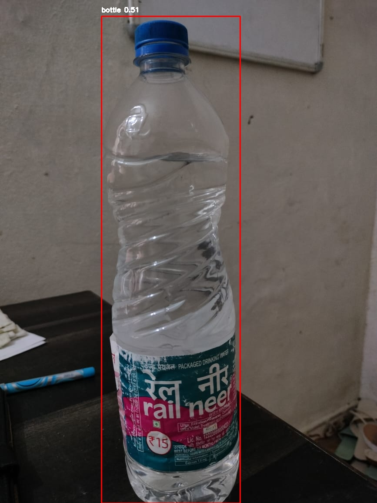
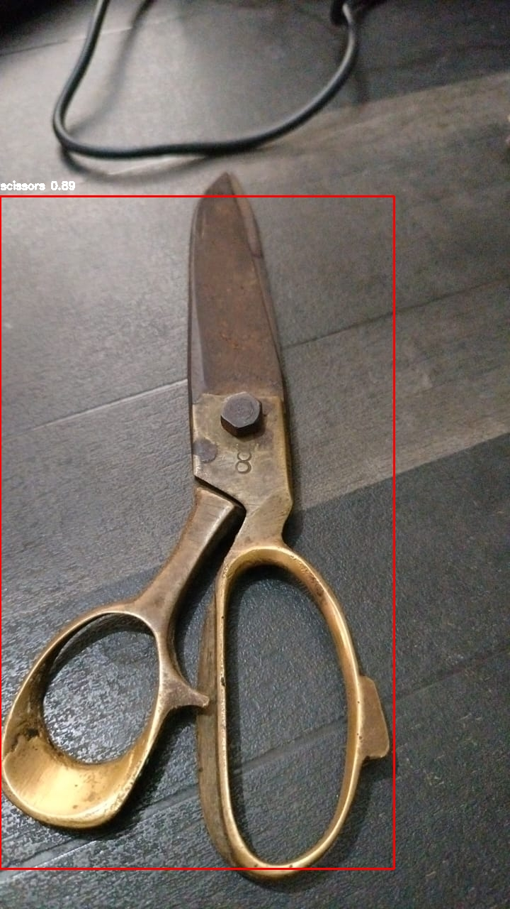

**[TRY OUT THE DEPLOYED PROJECT](https://objectdetectionrealtime.streamlit.app/)**

# YOLOv8 Object Detection with Streamlit

This project provides an interactive web application built with [Streamlit](https://streamlit.io/) for real-time object detection using [YOLOv8](https://github.com/ultralytics/ultralytics). It supports detection on images, videos, and live webcam feeds.

## Features

- **Multi-Source Detection**: Analyze objects from three different sources:
  - **Image Detection**: Upload an image to detect objects.
  - **Video Detection**: Upload a video file for frame-by-frame object detection.
  - **Webcam Detection**: Use your webcam for live, real-time detection.
- **Flexible Model Selection**: Choose from various YOLOv8 models (`yolov8n`, `yolov8s`, `yolov8m`, `yolov8l`, `yolov8x`) to balance speed and accuracy.
- **Adjustable Confidence**: Fine-tune detection sensitivity with a confidence threshold slider.
- **Class Filtering**: Select specific object classes for focused analysis.
- **Save & Export**: Save processed images and videos with detected bounding boxes.

## Demos

### Image Detection

Below are examples of how the app processes images to detect objects.

| Original Image | Processed Image |
|----------------|-----------------|
|  |  |
|  |  |

### 📸 Webcam Detection

[▶️ Webcam Demo - WhatsApp Video](./demos/WhatsApp%20Video%202025-08-07%20at%2019.18.58_18199167.mp4)


## 📂 Project Structure

```
├── app.py                    # Main Streamlit app file
├── detector.py               # ObjectDetector class for YOLOv8
├── utils.py                  # Helper functions (e.g., drawing boxes)
├── requirements.txt          # Project dependencies
├── README.markdown           # Project README file
├── LICENSE.txt               # License file
├── pages/
│   ├── 1_Image_Detection.py  # Image detection page
│   ├── 2_Video_Detection.py  # Video detection page
│   └── 3_Webcam_Detection.py # Webcam detection page
├── demos/                    # Folder for demo images and GIFs used in README
├── sample_images/            # Folder for additional sample images
├── sample_videos/            # Folder for additional sample videos
```

## 🛠️ Setup and Installation

Follow these steps to set up the project on your local machine.

1. **Clone the repository**:
   ```bash
   git clone <https://github.com/psbandwal/Real-Time-Object-Detection>
   cd <Real Time Object Detection>
   ```

2. **Create and activate a virtual environment**:
   ```bash
   # For Windows
   python -m venv venv
   .\venv\Scripts\activate

   # For macOS/Linux
   python -m venv venv
   source venv/bin/activate
   ```

3. **Install PyTorch with CUDA support**:
   For the best performance with a GPU, install PyTorch before other requirements. Choose the command matching your CUDA version. Check [PyTorch's website](https://pytorch.org/get-started/locally/) for other versions.
   ```bash
   # Example for CUDA 12.1
   pip3 install torch torchvision torchaudio --index-url https://download.pytorch.org/whl/cu121

   # Example for CUDA 11.8
   pip3 install torch torchvision torchaudio --index-url https://download.pytorch.org/whl/cu118

   # CPU-only (if no GPU)
   pip3 install torch torchvision torchaudio
   ```

4. **Install remaining dependencies**:
   ```bash
   pip install -r requirements.txt
   ```

## ▶️ How to Run

Once the installation is complete, run the Streamlit app:
```bash
streamlit run app.py
```

The application will open in your default web browser. Navigate through the sidebar to select Image Detection, Video Detection, or Webcam Detection.

## Notes

- Ensure your webcam is properly configured for webcam detection.
- For video detection, supported formats include MP4, AVI, etc., though demos are shown as GIFs in the README.
- Adjust the confidence threshold and model selection in the app to optimize performance for your use case.
- Demo images and GIFs are stored in the `demos/` folder, while additional sample images and videos are stored in `sample_images/` and `sample_videos/`, respectively. Ensure all files are committed to your repository for the README to render correctly.

## License

This project is licensed under the MIT License. See the [LICENSE](LICENSE) file for details.
